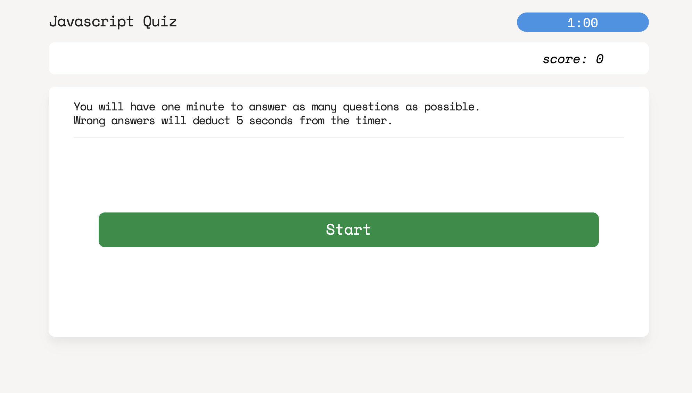
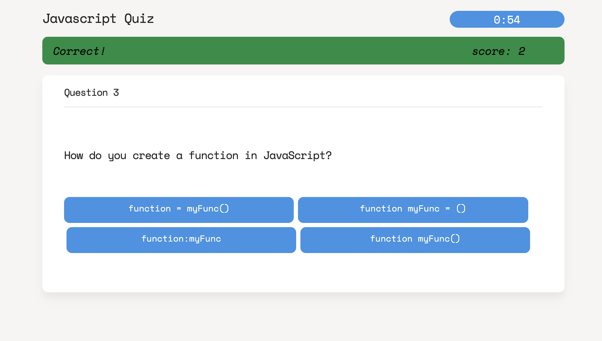
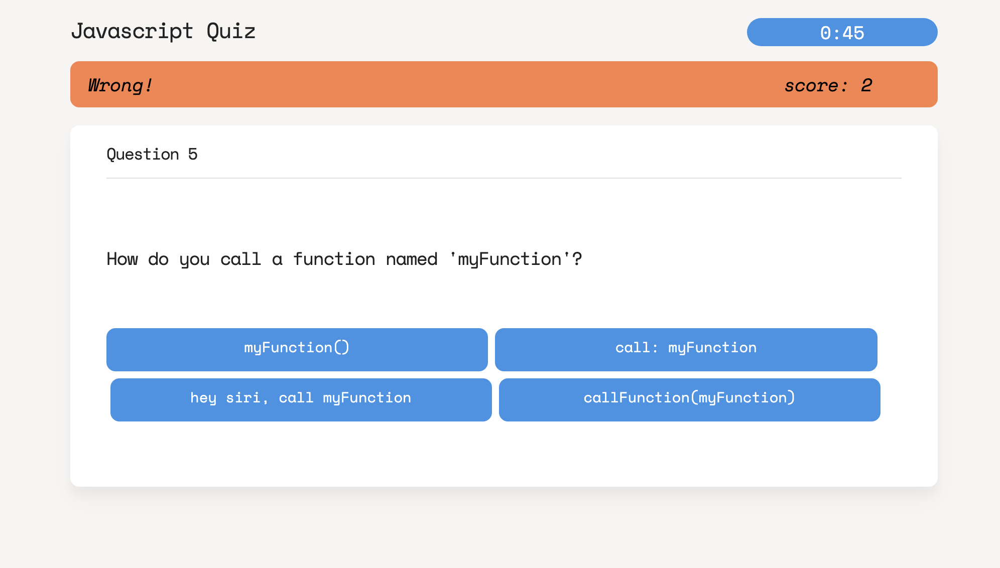
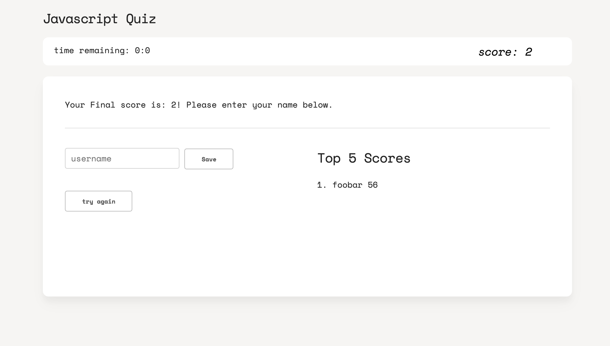
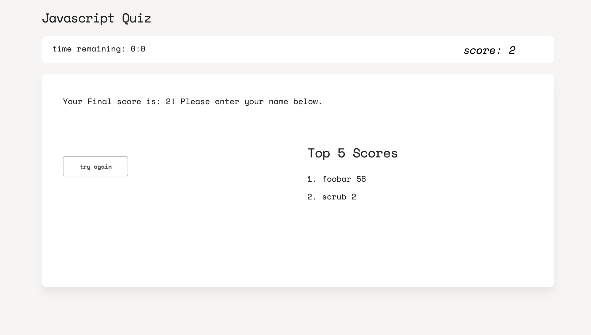

# [04-Quiz](https://joe-zu.github.io/04-Quiz/)

https://joe-zu.github.io/04-Quiz/

## Overview
This application is designed to test the knowledge of those who are learning javascript. 
Users only have 60 seconds to answer 20 questions. If all the questions are answered or if time runs out, the quiz will end and the user will be able to submit thier name + score to the Top 5 leader board.

## Structure
This application runs on one page with mostly DOM manipulation to populate questions and then clear them away.
There are 3 main stages: 

1. Start
1. Quiz
1. Scoring

Each stage takes over the html while the others are hidden. 

## Scoring
Each correct answer scores 1 point. Each incorrect answer deducts 5 seconds from the timer. At the end of the quiz any remaining seconds will be added as points. 

Scores are stored and sorted in the Local Storage. The Top 5 scores will be displayed at the end of the quiz. Any results that do not make the Top 5 will be sadly forgotton. 

Enjoy!

below are screen captures of the application depicting various states. 

 
 
 
 
 